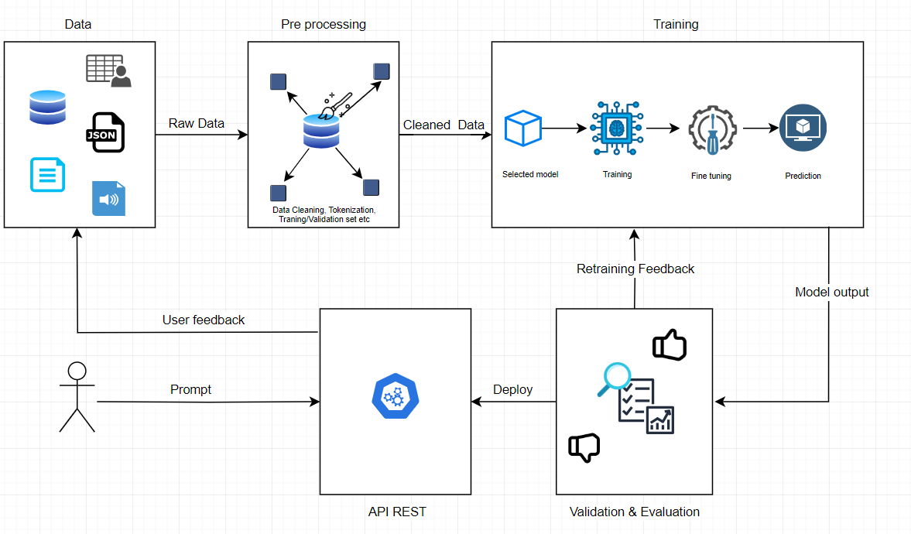
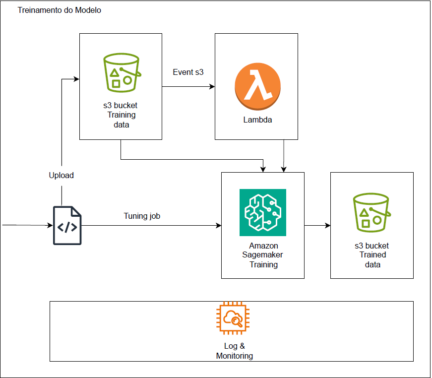
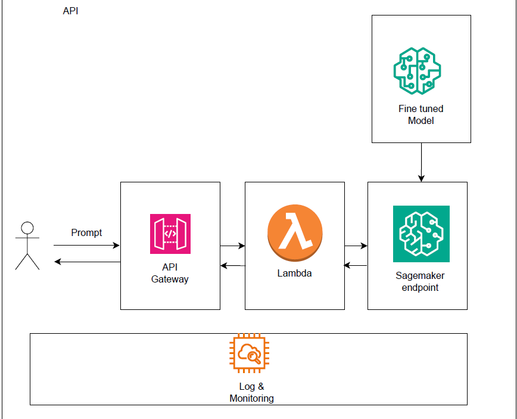

# Fine-Tuning A Model and Deploying as an API

This repository contains a guide to the process of fine-tuning a model with your own dataset and deploying it as an API to answer questions. The guide is divided into two main sections: fine-tuning the model and deploying the API.

## Overview


## Fine-Tuning the Model

Fine-tuning is the process of taking a pre-trained model and training it further on a specific dataset to improve its performance on that dataset.

### Prerequisites
- Python 3.6 or higher
- Transformers 
- Datasets 
- PyTorch
- A dataset of question-answer pairs

### Installation

1. Clone this repository:

    ```bash
    git clone https://github.com/csuwaki/fine_tuning_ml.git
    ```

2. Navigate to the repository directory:

    ```bash
    cd src
    ```

3. Install the required dependencies:

    ```bash
   pip install -r requirements.txt
    ```

  
### Steps
1. Load Model and Tokenizer
   - Load a pre-trained  model and tokenizer.
   - Set the tokenizer's padding token to the EOS token to handle variable sequence lengths.
2. Prepare Data
   - Load your dataset from a JSON file.
   - Clean the data to ensure that each entry has both a question and an answer.
   - Tokenize the questions and answers.
3. Train/Test Split
   - Split the tokenized data into training and validation sets.
4. Set Training Arguments
   - Configure the training arguments, such as learning rate, batch size, and number of epochs.
5. Train the Model
   - Train the model using the Trainer class from the Transformers library.
   - Evaluate the model's performance on the validation set.
6. Save Model and Tokenizer
   - Save the fine-tuned model and tokenizer to disk for later use. The output directories will be generated automatically.


## Training Overview



## Fine Tuning Usage

1. Navigate to the fine tuning directory:

    ```bash
    cd src
    ```

2. Place your dataset file in the data directory.

3. Run the fine-tuning script from the command line, providing the --data-path:


```sh
python fine_tuning_ml_case.py --data-path /path/to/your/datafile.txt 
```

Output should be:

```sh
Processing data from: /path/to/your/datafile.txt
Model will be saved to: /path/to/output/model
Tokenizer will be saved to: /path/to/output/tokenizer
```
5. After fine-tuning, the trained model and tokenizer will be saved in the specified output directories.
   
## Deploying the Model as an API

## Prerequisites
- Python 3.6 or higher
- transformers 
- fastapi 
- uvicorn 

1. Navigate to the api directory:

    ```bash
    cd src
    ```

2. Run the API server:

    ```bash
    uvicorn api:app --reload
    ```

3. The API server will start running locally. You can access the API documentation at `http://localhost:8000/docs`.

## API Usage

You can use the API to generate answers for questions. Here's an example of how to use it:

```python
curl -X 'POST' \
  'http://127.0.0.1:8000/predict' \
  -H 'accept: application/json' \
  -H 'Content-Type: application/json' \
  -d '{"question": "What is the purpose of a return route?"}'
  ```

## API OVerview

